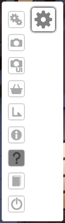
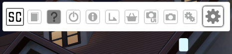
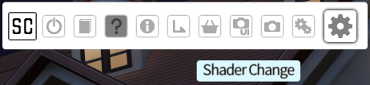

# COM3D2.GUIExt
Extension of [CM3D2.GearMenu](https://github.com/neguse11/CM3D2.GearMenu) ported for COM3D2, partially hotfixing the lack of tooltips for ported CM3D2 plugins, which were broken due to a change in `SystemShortcut.VisibleExplanation`.

## Requirements

- UnityInjector.dll 1.0.4.1+
- ExIni.dll 1.0.2.1+
- PluginExt.dll 2.0.5727+
All of the required dlls are bundled in Sybaris and BepInEx AIO packs.

## Compiling Requirements

- Target Framework .NET 3.5

## Usage

Unlike GearMenu, GUIExt is built as a plugin with the button methods exposed statically. The basic usage is essentially identical to reduce effort in porting from CM3D2 to COM3D2. The main emphasis of this library was to avoid causing issues with ported CM3D2 plugins which are using GearMenu.

```C#
using COM3D2.GUIExt;

namespace COM3D2.Example.Plugin
[PluginName("Example"), PluginVersion("0.0.0.1")]
public class ExamplePlugin : PluginBase
{
	GameObject goButton;
	void Awake()
	{
		goButton = GUIExt.Add("Example", "Toggle Example Button", (go) => { enabled = !enabled; });
	}
	void OnEnable()
	{
	      GUIExt.SetFrameColor(goButton, Color.red);
	}
	void OnDisable()
	{
		GUIExt.ResetFrameColor(goButton);
	}
	void OnGUI()
	{
		GUI.Label(new Rect(0, 0, Screen.width, Screen.height), "Example Text");
	}
}
```

## Extension Capabilities

GUIExt is able to hide buttons from the gear menu through modification of `UnityInjector/Config/GUIExtButtons.ini`. The buttons to be hidden or visible are customisable for each scene. This does not improve performance, but it can reduce clutter, especially if many plugins are loaded which utilise GearMenu or GUIExt. An example of this is a greatly cleaned up title screen menu:


The format of `UnityInjector/Config/GUIExtButtons.ini` is:
```ini
[Global]
; Buttons in this section are updated on every scene change, allowing for either whitelisting or blacklisting depending on usage
ToTitle=True
; ToTitle is the name of the return to title screen button. In this case, we wish to only disable it in the title screen, so we enable it everywhere else
Shop=False
; In this example, we wish to disable the Shop button entirely. This button only appears if you are connected to the internet.
[SceneTitle]
; Every subsequent section has the same name as a scene. Only a few are listed in the default config, but any scene in the game can be used.
ToTitle=False
; As mentioned above, we wish to disable the return to title screen button while in the title screen, as it is useless.
Help=False
; The Help button is also greyed out in the title screen, so we will hide it.
Dic=False
; This is the glossary popup button, we don't need it in the title screen.
Info=False
; This is the tutorial popup button, we don't need it in the title screen.
Example Plugin=False
; The majority of plugins which use GearMenu can be hidden additionally. More details on their naming is provided below.
[SceneEdit]
; This is the edit menu, we could hide or show other buttons here if desired
```

The names of the default gear buttons are:

- Config: Settings menu
- Ss: Screenshot Button
- SsUi: Screenshot without UI Button
- Shop: Link to the store page
- ToTitle: Return to title screen Button
- Info: Information Button
- Help: Help Button
- Dic: Dictionary / Glossary Menu
- Exit: Quit game Button

It is also possible to change the maximum number of buttons allowed horizontally, leading to other possible styles such as a vertical gear menu, or a square menu. This however cannot be changed across scenes.




This value is saved in `UnityInjector/Config/GUIExtConfig.ini`. At the moment, it is the only value specified by the configuration file. If set to -1, it will default to allowing the maximum amount of icons horizontally (32 for 1920x1080px resolution).

## Real-time Tooltip Fixing




As GUIExt is loaded as a plugin, it is able to monitor the status of the gear menu while the game is running. Tooltips are not shown when hovering over buttons provided by ported CM3D2 plugins. It is not easily possible to fix this issue without changing the CM3D2 plugins, so GUIExt will attempt to provide a tooltip based off the `name` field of the button `GameObject`. The reason why this is possible is because CM3D2.GearMenu defaulted to naming the button `GameObject`s from the plugin name. By forcing the `onHoverOut` event on each externally provided button, GUIExt is able to determine which buttons do not provide a tooltip, and provide a new wrapped `SystemShortcut.VisibleExplanation` method which will show tooltips. Unfortunately, this fix will not work on every plugin, as there are plugins which did not provide a usable `name` field. These plugins are likely to be listed as `Config(Clone)` as GearMenu buttons (and GUIExt) default to using the internal `Config` button as a child of the gear menu. As these plugins will have the same name, they will not work effectively with the hiding button feature. Additionally, there are plugins which create a new button `GameObject` on every `Update` tick. GUIExt is designed to handle plugins creating and deleting buttons upon transitioning scene, however it is not able to hotfix plugins which continually recreate the same broken button.

## SystemShortcut.VisibleExplanation

`SystemShortcut.VisibleExplanation` is defined in COM3D2's `Assembly-CSharp.dll` assembly as follows:

```C#
public void VisibleExplanation(string text, bool visible)
{
	if (visible)
	{
		this.m_labelExplanation.text = LocalizationManager.GetTranslation(text, true, 0, true, false, null, null);
		this.m_labelExplanation.width = 0;
		this.m_labelExplanation.MakePixelPerfect();
		UISprite component = this.m_spriteExplanation.GetComponent<UISprite>();
		component.width = this.m_labelExplanation.width + 15;
	}
	this.m_spriteExplanation.gameObject.SetActive(visible);
}
```

It is defined in CM3D2 as follows:
```C#
public void VisibleExplanation(string text, bool visible)
{
	if (visible)
	{
		this.m_labelExplanation.text = text;
		this.m_labelExplanation.width = 0;
		this.m_labelExplanation.MakePixelPerfect();
		UISprite component = this.m_spriteExplanation.GetComponent<UISprite>();
		component.width = this.m_labelExplanation.width + 15;
	}
	this.m_spriteExplanation.gameObject.SetActive(visible);
}
```

From here, we can see the issue is the inclusion of the `LocalizationManager.GetTranslation` method:

```C#
public static string GetTranslation(string Term, bool FixForRTL = true, int maxLineLengthForRTL = 0, bool ignoreRTLnumbers = true, bool applyParameters = false, GameObject localParametersRoot = null, string overrideLanguage = null)
{
	string result = null;
	LocalizationManager.TryGetTranslation(Term, out result, FixForRTL, maxLineLengthForRTL, ignoreRTLnumbers, applyParameters, localParametersRoot, overrideLanguage);
	return result;
}
```

```C#
public static bool TryGetTranslation(string Term, out string Translation, bool FixForRTL = true, int maxLineLengthForRTL = 0, bool ignoreRTLnumbers = true, bool applyParameters = false, GameObject localParametersRoot = null, string overrideLanguage = null)
{
	Translation = null;
	if (string.IsNullOrEmpty(Term))
	{
		return false;
	}
	LocalizationManager.InitializeIfNeeded();
	int i = 0;
	int count = LocalizationManager.Sources.Count;
	while (i < count)
	{
		if (LocalizationManager.Sources[i].TryGetTranslation(Term, out Translation, overrideLanguage, null, false, false))
		{
			if (applyParameters)
			{
				LocalizationManager.ApplyLocalizationParams(ref Translation, localParametersRoot);
			}
			if (LocalizationManager.IsRight2Left && FixForRTL)
			{
				Translation = LocalizationManager.ApplyRTLfix(Translation, maxLineLengthForRTL, ignoreRTLnumbers);
			}
			return true;
		}
		i++;
	}
	return false;
}
```

Essentially, the term put through the translator is set to `null` and unhandled if there isn't a stored translation already available. To avoid this, GUIExt uses reflection to access the private class fields:

```C#
public static void VisibleExplanationRaw(string text, bool visible = true)
{
	UILabel _labelExplanation = typeof(SystemShortcut).GetField("m_labelExplanation", BindingFlags.Instance | BindingFlags.NonPublic).GetValue(_SysShortcut) as UILabel;
  	_labelExplanation.text = text;
	_labelExplanation.width = 0;
	_labelExplanation.MakePixelPerfect();
	UISprite _spriteExplanation = typeof(SystemShortcut).GetField("m_spriteExplanation", BindingFlags.Instance | BindingFlags.NonPublic).GetValue(_SysShortcut) as UISprite;
	_spriteExplanation.width = _labelExplanation.width + 15;
	_spriteExplanation.gameObject.SetActive(visible);
}
```

GUIExt is mostly untested, as I have not spent much time on it so far. Please create an Issue in GitHub if any errors arise.
