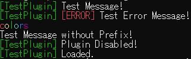
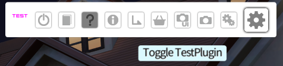
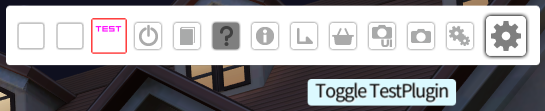
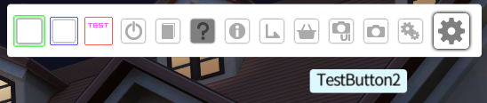
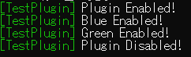

# COM3D2.GUIExt TestPlugin

This example plugin showcases simple usage of `COM3D2.GUIExt.cs`.

## Example

TestPlugin loads and immediately disables itself.

Upon clicking on the TestPlugin menu button, it is enabled and creates two new buttons.

Clicking these buttons showcases different outline colours as well as console output.

When the TestPlugin button is clicked again, it is disabled and destroys the two buttons.

This should be compatible with CM3D2 PluginManager, although I haven't tested it.
